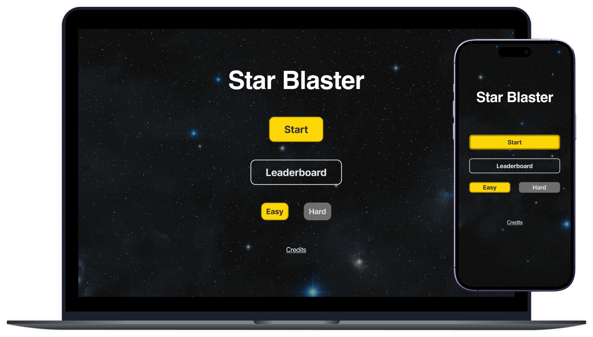

# Star Blaster
**A legacy game gets spun into the new age with an updated, modern look and feel.**
<a href="https://star_blaster_bw.surge.sh/">Play the game here,</a> and continue on for more info on the project.

## Technologies Used
- **HTML 5**
- **CSS 3**
- **Javascript**

## Key Features
- **Browser-based game utilizing HTML / CSS / JavaScript and used JavaScript to serve as the front-end methods and functions.**
- **Created an “Asteroids” remake with some new-aged spins on the original game and included a leaderboard and different levels of difficulty for users.**
- **User shoots asteroids for points, the more the points the greater the chance to be on the leaderboard for the challenge level.**
- **Text-based game enabling users to reach various "destinations" based on their input, incorporating initial data types, variables, operators, conditional blocks, and interactive user input.**

## App Images

## License
- **MIT**
